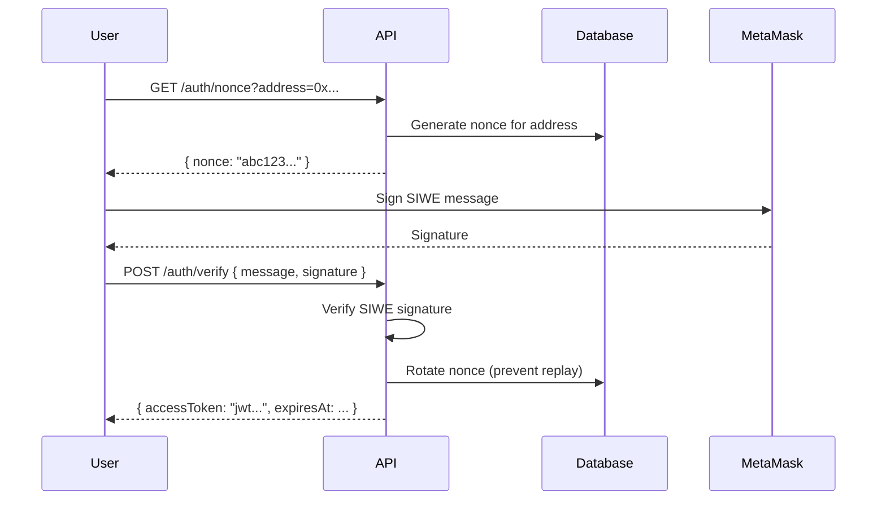
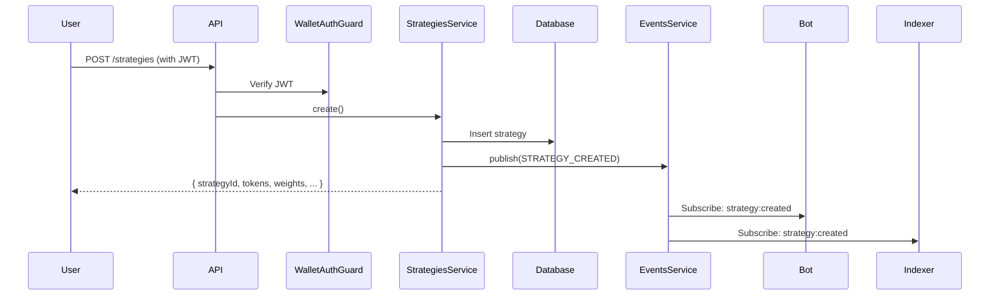
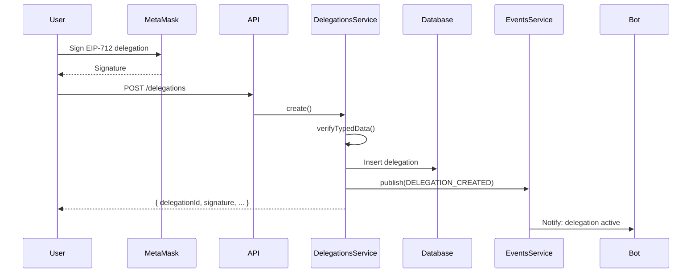
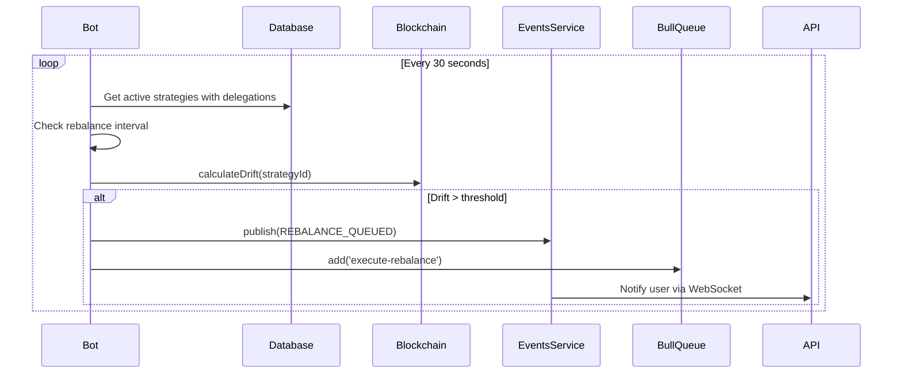
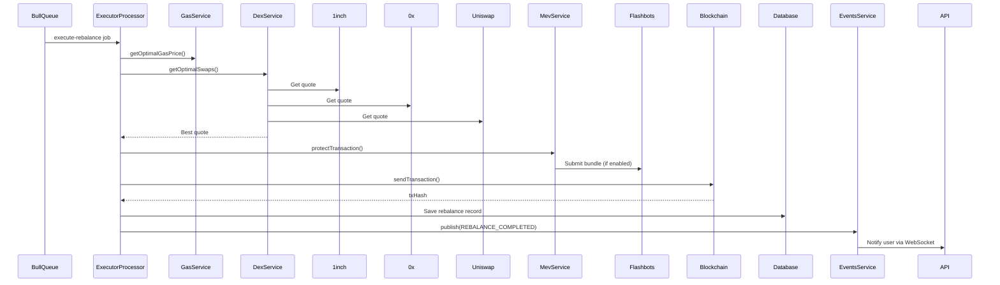
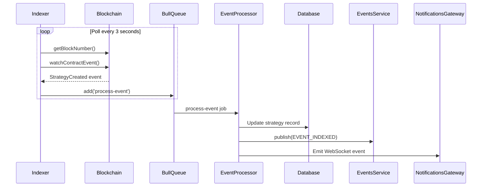

# Rebased Backend - End-to-End Flow Documentation

## Architecture Overview

The Rebased backend is a NestJS microservices architecture with three main applications:

```
┌─────────────┐      ┌─────────────┐      ┌─────────────┐
│  API Server │      │ Bot Worker  │      │  Indexer    │
│  (Port 3000)│      │  (Cron)     │      │  (Events)   │
└──────┬──────┘      └──────┬──────┘      └──────┬──────┘
       │                    │                     │
       └────────────────────┼─────────────────────┘
                            │
                ┌───────────┴───────────┐
                │  Shared Infrastructure │
                ├───────────────────────┤
                │ PostgreSQL (Prisma)   │
                │ Redis (Bull + Pub/Sub)│
                │ Socket.IO (WebSocket) │
                │ Viem (Blockchain)     │
                └───────────────────────┘
```

## Complete User Journey

### 1. User Authentication (SIWE)

**Frontend → API Server**



**API Endpoints:**

- `POST /auth/nonce` - Get nonce for address
- `POST /auth/verify` - Verify signature and get JWT

**Files:**

- `apps/api/src/auth/auth.service.ts:25` - getNonce()
- `apps/api/src/auth/auth.service.ts:40` - verifySignature()

---

### 2. Create Strategy

**Frontend → API Server → Database**



**Request Body:**

```json
{
  "chainId": 10143,
  "tokens": ["0xToken1...", "0xToken2..."],
  "weights": [5000, 5000],
  "rebalanceInterval": 86400
}
```

**Files:**

- `apps/api/src/strategies/strategies.controller.ts:24` - create()
- `apps/api/src/strategies/strategies.service.ts:28` - create()
- `libs/events/src/event-types.ts:34` - StrategyCreatedEvent

---

### 3. Create Delegation (ERC-7710)

**Frontend → API Server → Database**



**EIP-712 Structure:**

```typescript
{
  domain: {
    name: "Rebased DelegationManager",
    version: "1",
    chainId: 10143,
    verifyingContract: "0xDelegationManager..."
  },
  types: {
    Delegation: [
      { name: "delegate", type: "address" },
      { name: "authority", type: "bytes32" },
      { name: "caveats", type: "Caveat[]" },
      { name: "salt", type: "uint256" }
    ],
    Caveat: [
      { name: "enforcer", type: "address" },
      { name: "terms", type: "bytes" }
    ]
  },
  message: { ... }
}
```

**Files:**

- `apps/api/src/delegations/delegations.service.ts:63` - create()
- `apps/api/src/delegations/delegations.service.ts:24` - getDomain()
- `libs/events/src/event-types.ts:58` - DelegationCreatedEvent

---

### 4. Bot Monitors Strategies

**Bot Worker (Cron)**



**Monitor Logic:**

- Check if `lastRebalance + rebalanceInterval < now`
- Call `StrategyRegistry.calculateDrift(strategyId)` on-chain
- If drift ≥ threshold (e.g., 5%), queue rebalance

**Files:**

- `apps/bot/src/monitor/monitor.service.ts:24` - monitorStrategies()
- `apps/bot/src/monitor/monitor.service.ts:65` - checkStrategy()

---

### 5. Bot Executes Rebalance

**Bot Worker (Bull Queue Consumer)**



**Execution Steps:**

1. Check gas price (must be < maxGasPrice)
2. Get optimal swap routes from DEX aggregators
3. Apply MEV protection (Flashbots/intents)
4. Send transaction with delegation proof
5. Wait for confirmation
6. Update database and notify user

**Files:**

- `apps/bot/src/executor/executor.processor.ts:28` - handleRebalance()
- `apps/bot/src/dex/dex.service.ts:21` - getOptimalSwaps()
- `apps/bot/src/mev/mev.service.ts:27` - protectTransaction()

---

### 6. Indexer Listens to Events

**Indexer Worker**



**Watched Contracts:**

- `StrategyRegistry` - StrategyCreated, StrategyUpdated, StrategyDeactivated
- `DelegationManager` - DelegationCreated, DelegationRevoked
- `DelegateExecutor` - RebalanceExecuted, RebalanceFailed

**Files:**

- `apps/indexer/src/listeners/chain-listener.service.ts:36` - startListening()
- `apps/indexer/src/processors/event.processor.ts:23` - handleEvent()

---

## Redis Pub/Sub Event Flow

All services communicate via Redis pub/sub for real-time coordination:

```
┌──────────────────────────────────────────────────┐
│              Redis Pub/Sub Channels              │
├──────────────────────────────────────────────────┤
│ strategy:created    → Bot, Indexer               │
│ strategy:updated    → Bot                        │
│ delegation:created  → Bot                        │
│ rebalance:queued    → API (WebSocket)            │
│ rebalance:started   → API (WebSocket)            │
│ rebalance:completed → API (WebSocket), Analytics │
│ event:indexed       → Analytics                  │
│ gas:updated         → Bot                        │
│ system:alert        → All                        │
└──────────────────────────────────────────────────┘
```

**Files:**

- `libs/events/src/event-types.ts` - All event types
- `libs/events/src/events.service.ts:52` - publish()
- `libs/events/src/events.service.ts:63` - subscribe()

---

## Database Schema

**Key Models:**

```prisma
User {
  address       String   @id
  nonce         String
  strategies    Strategy[]
  delegations   Delegation[]
}

Strategy {
  id                String
  chainId           Int
  strategyId        BigInt
  userAddress       String
  tokens            String[]
  weights           Int[]
  rebalanceInterval BigInt
  isActive          Boolean
}

Delegation {
  id              String   @id
  chainId         Int
  strategyId      String
  userAddress     String
  delegateAddress String
  delegationData  Json     // ERC-7710
  signature       String   // EIP-712
  isActive        Boolean
}

Rebalance {
  id         String
  strategyId String
  chainId    Int
  txHash     String
  drift      BigInt
  gasUsed    BigInt
  status     RebalanceStatus // SUCCESS | FAILED | PENDING
}
```

**Files:**

- `libs/database/src/schema.prisma`

---

## Smart Contract Integration Points

**Contracts Required (TODOs in codebase):**

1. **StrategyRegistry** (Monad + Base)
   - `createStrategy(tokens, weights, rebalanceInterval)`
   - `calculateDrift(strategyId) returns (uint256)`
   - `updateStrategy(strategyId, weights, rebalanceInterval)`

2. **DelegationManager** (Monad + Base)
   - `createDelegation(Delegation calldata delegation, bytes signature)`
   - `revokeDelegation(bytes32 delegationHash)`
   - `validateDelegation(bytes32 delegationHash) returns (bool)`

3. **DelegateExecutor** (Monad + Base)
   - `executeRebalance(uint256 strategyId, SwapData[] swaps, Delegation proof)`
   - Uses ERC-7710 delegation validation

**Contract ABIs needed in:**

- `libs/blockchain/src/` - Add ABI files
- Update services to use `encodeFunctionData` and `decodeFunctionResult`

---

## WebSocket Real-Time Updates

**Socket.IO Events:**

```typescript
// Client subscribes to user-specific room
socket.emit("join", { address: "0x..." });

// Server emits to user
socket.to(`user:0x...`).emit("rebalance:started", {
  strategyId: "...",
  drift: 6.5,
  timestamp: "2024-01-01T00:00:00Z",
});

socket.to(`user:0x...`).emit("rebalance:completed", {
  strategyId: "...",
  txHash: "0x...",
  gasUsed: "250000",
  success: true,
});
```

**Files:**

- `libs/notifications/src/notifications.gateway.ts:23` - emitRebalanceStarted()
- `libs/notifications/src/notifications.gateway.ts:27` - emitRebalanceCompleted()

---

## Configuration

**Environment Variables (100+ required):**

```bash
# Database
DATABASE_URL="postgresql://..."

# Redis
REDIS_HOST=localhost
REDIS_PORT=6379

# JWT
JWT_SECRET=your-secret-key
JWT_EXPIRES_IN=7d

# Blockchain (Monad)
MONAD_RPC_URL=https://testnet.monad.xyz
MONAD_STRATEGY_REGISTRY=0x...
MONAD_DELEGATION_MANAGER=0x...
MONAD_DELEGATE_EXECUTOR=0x...

# Blockchain (Base)
BASE_RPC_URL=https://sepolia.base.org
BASE_STRATEGY_REGISTRY=0x...
BASE_DELEGATION_MANAGER=0x...
BASE_DELEGATE_EXECUTOR=0x...

# Bot
BOT_PRIVATE_KEY=0x...
BOT_DRIFT_THRESHOLD=500  # 5%
BOT_MAX_GAS_PRICE=100000000000

# DEX Aggregators
ENABLE_1INCH=true
1INCH_API_KEY=your-key
ENABLE_0X=true
0X_API_KEY=your-key
ENABLE_PARASWAP=true
ENABLE_UNISWAP=true

# MEV Protection
ENABLE_FLASHBOTS=true
FLASHBOTS_RPC=https://rpc.flashbots.net
ENABLE_INTENTS=true
```

**Files:**

- `.env.example` - All environment variables
- `libs/config/src/configuration.ts` - Config loading
- `libs/config/src/validation.schema.ts` - Joi validation

---

## Error Handling & Retry Logic

**Bull Queue Retry Strategy:**

```typescript
{
  attempts: 3,
  backoff: {
    type: 'exponential',
    delay: 2000  // 2s, 4s, 8s
  }
}
```

**Failed Rebalance Flow:**

1. Executor catches error
2. Saves rebalance with status=FAILED
3. Emits `rebalance:failed` event
4. Notifies user via WebSocket
5. Bull retries job (up to 3 times)
6. If all attempts fail, job moves to failed queue

**Files:**

- `apps/bot/src/executor/executor.processor.ts:118` - Error handling
- `libs/queue/src/queue.module.ts:11` - Retry config

---

## Monitoring & Health Checks

**Health Endpoints:**

```bash
GET /health
# { status: "ok", timestamp: "...", uptime: 1234 }

GET /health/detailed
# {
#   status: "healthy",
#   checks: {
#     api: "ok",
#     database: "ok",
#     redis: "ok",
#     monadRpc: "ok",
#     baseRpc: "ok"
#   }
# }
```

**Files:**

- `apps/api/src/health/health.service.ts:22` - detailedCheck()

---

## Security Considerations

1. **SIWE Nonce Rotation**: Nonces are rotated after each verification to prevent replay attacks
2. **JWT Expiration**: Tokens expire after 7 days (configurable)
3. **EIP-712 Signature Verification**: All delegations verified on-chain
4. **Rate Limiting**: (Phase 6 - skipped)
5. **Gas Price Limits**: Bot refuses to execute if gas > maxGasPrice
6. **Price Impact Limits**: DEX swaps rejected if slippage > maxPriceImpact

**Files:**

- `apps/api/src/auth/auth.service.ts:56` - Nonce rotation
- `apps/api/src/delegations/delegations.service.ts:78` - Signature verification
- `apps/bot/src/executor/executor.processor.ts:51` - Gas price check

---

## Testing the Complete Flow

See [TESTING.md](./TESTING.md) for detailed testing instructions.

---

## Next Steps

1. **Deploy Smart Contracts**: Deploy StrategyRegistry, DelegationManager, DelegateExecutor to Monad + Base
2. **Add Contract ABIs**: Add ABI files to `libs/blockchain/src/abis/`
3. **Implement On-Chain Calls**: Replace TODOs with actual contract interactions
4. **Configure DEX APIs**: Add API keys for 1inch, 0x
5. **Setup Flashbots**: Configure Flashbots RPC endpoint
6. **Frontend Integration**: Build Next.js frontend consuming these APIs
7. **Testnet Deployment**: Deploy to Base Sepolia + Monad testnet
8. **Mainnet Readiness**: Security audit, stress testing, monitoring setup
